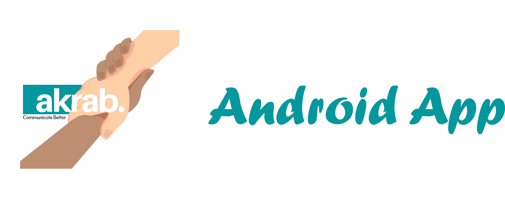
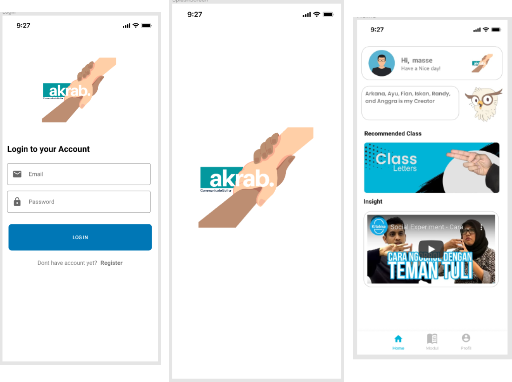

 

## User Interface Akrab

 

## Library
- Retrofit for API
- Tensorflow-lite for machine learning
- Camera X for Camera
    
## features Application
- Modul Sign Language
- Class Language (Alphabets & Numbers)
- Predicted Sign Language
- Maskot Guide
- Logging @ Registering

# Team Mobile Development
Fian Ardi Saputra & Iskandar Sholeh
